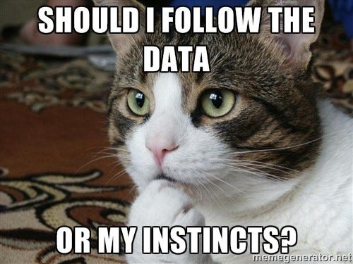

# Statistical Explorations
Code from Jackson Baker

This repository is for storing notebooks for reference to perform statistical calculations. I'm editing these notebooks using Jupyter Notebooks - I could also use Google CoLab as well, which I have experience with from undergrad, but I've been heavily using Jupyter for DSCI 6113 and want to further develop my familiarity with the tool. I'm excited to put more of the statistical concepts I've learned from this class and others into practice and coding these statistical tests.

Thank you! 

---

*P.S. I've also included a funny cat meme, one of my deep special interests, relating to this unit on descriptive statistics.*

